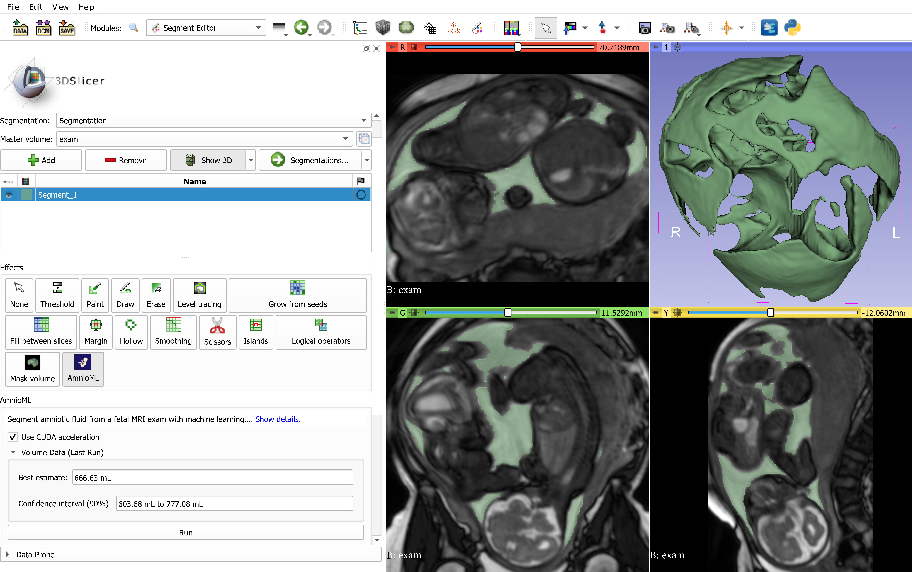
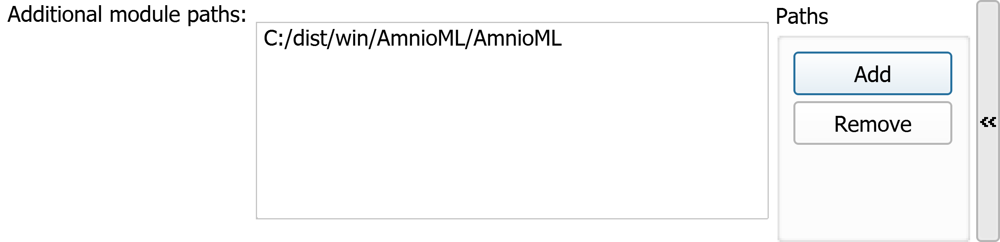

# AmnioML

A 3D Slicer plugin that segments the amniotic fluid in Fetal MRI exams and provides a predictive interval for the volume.



## Folder Contents

- `slicer_plugin`: source code of the GUI (3D Slicer segmentation plugin)
- `src/models`: generation of the predictions using the trained model


## Installation Instructions

To instal AmnioML, follow the instructions bellow after downloading one of the  or building the plugin yourself.

1. Open the 3D Slicer application.
2. Click on Edit -> Application Settings.
3. On the left panel, click on Modules.
4. Add an additional module path pointing to the plugin, as in the example bellow:

   

5. Click OK and restart 3D Slicer.

## Build Instructions (Windows 10/11)

Building the Windows binaries from source is a two-steps process.

1. Open a PowerShell as Administrator in this folder, and allow the execution of scripts by running the following command:

```
Set-ExecutionPolicy Unrestricted -Scope Process
```

2. Run the PowerShell script
```
.\build.ps1 --cuda
```
or
```
build.ps1
```
to compile without CUDA support.

### Operations Performed by `build.ps1`

1. Download and install Python 3.9.10
2. Download the trained model's checkpoint
3. Create and populate a venv in `build\win\venv`
4. Create the binaries and save them in `dist\win\AmnioML`

### Observation

Due to a long standing bug that causes `pip` to create huge RAM allocation spikes (see [https://github.com/pypa/pip/issues/9678#issue-820454549](https://github.com/pypa/pip/issues/9678#issue-820454549)) before the installation of big packages such as PyTorch, 16GB of RAM is recommended for the building process.

## Build Instructions (Linux)

Install `python3` and `pip` using your distro's instructions, and run
```
.\build.sh --cuda
```
or
```
build.sh
```
to compile without CUDA support.


This script will execute steps 2-4 from the description of `build.ps1`.

### Observation

The aforementioned bug also applies to the Linux version of `pip`, but a large enough swap file should avoid any crashes.


